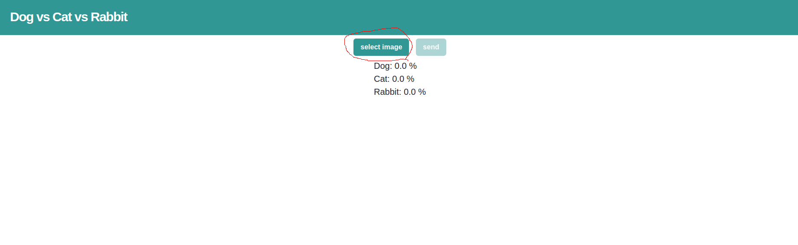
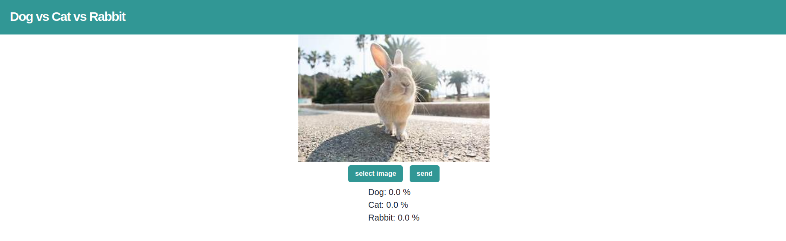
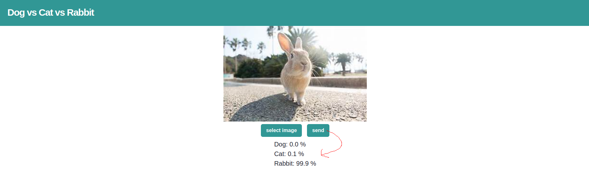

## 環境構築

1. `docker-compose up`を実行

2. `http://localhost:3000/`にアクセス

## アプリケーション実行方法

1. ブラウザ上で、`select image`ボタンをクリックして、推論したい画像を選択

   

   初期画面の`select image`ボタンをクリック

   

   正常にアップロードされた場合は、上記の画像が表示される

2. `send`ボタンをクリックすると、推論確率が表示される

   

## 仕組み

本アプリケーションは、フロントエンドとバックエンドに分かれている。

### バックエンド

- torchserve(`https://pytorch.org/serve/`)にて構築

- 使用モデル: `https://github.com/ryota0051/dog-vs-cat-vs-rabbit-image-classifier` で学習した resnet18 ベースのモデル

- 役割: 画像ファイルをリクエストとして受け取り、以下のような形式の json を返す

  ```json
  {
    "Dog": 0.9,
    "Cat": 0.1,
    "Rabbit": 0.0
  }
  ```

### フロントエンド

- react にて構築

- 役割: http 通信を用いてバックエンドサーバーにリクエストを送信して推論結果レスポンスを画面に表示
